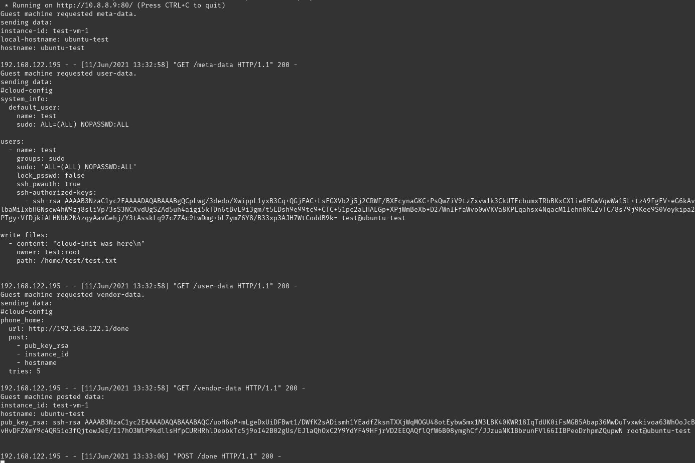

# **Making a Cloud-init VM Template for QEMU/KVM**
The goal of this project is to make a VM template that when launched will pull it's configuration from a remote data source and once done send a request to a predefined webhook containing the details of the machine. To do this we will be using QEMU/KVM as the virtualisation platform and cloud-init for configuring the machine.

---
## **Cloud-init:**
Cloud-init is a multi distribution, multi vendor cloud instance initialisation tool for configuring cloud instances, usually upon their first boot.
Cloud-init recieves configuration information from the cloud in three forms:
+ Cloud-metatadata: Initial information for setting up the basics of the instance such as setting instance id, networking configuration, etc... (the configuration in this section has the highest precedence)
+ User-data: Configuration provided by the user of the instance. This can be provided in multiple forms but the most prevalent is a cloud-config file describing the desired configuration of the system in yaml. The user can use a  number of modules to customize their instance to any instance. (eg. install/update packages, create users and groups, set ssh keys, ...)
+ Vendor-data: Similar to user-data but provided by the cloud vendor. Note, this data can be completely overridden or disabled by the user.

Cloud-init supports a number of different private and public clouds for the data source as well as the option not to use a cloud provider and configure the instance locally or by a simple network request with the NoCloud  data source.

---
## **KVM:**
Kernel-based Virtual Machine(KVM) is an open source virtualisation technology built into linux. It allows the linux kernel to act as a bare metal hypervisor and run multiple guests machines with minimal latency and performance impact.

## **QEMU:**
QEMU is an open source emulator and virtualiser that allows for emulating a host of devices such as VGA, USB, network interfaces, disks, etc... It can either be used to emulate full machines or it can use KVM to take advantage of hardware virtualisation and achieve better performance.
QEMU comes with a number of additional tools that make making, managing, and running virtual machine templates/images much easier such as qemu-img and libvirt.

---
## Making The Template:
First we need to make a VM template with Cloud-init preinstalled and correctly configured so that when a machine is launched using said template, it will automatically pull the configuration and send the desired data. We'll need to start off with a linux image. Most modern linux server distributions come with Cloud-init preinstalled but since the focus of this project is to learn how to make a VM template and setup Cloud-init, we will use Ubuntu 16.04 server which does not come with Cloud-init out of the box.
The image can be downloaded from [here](https://releases.ubuntu.com/16.04/).

After we have our image we need to make a disk image using qemu-img and run the machine on and customize it. (Note: make sure to either set or replace the environment variables with the desired values)
```bash
# create a 15G disk image
sudo qemu-img create -o preallocation=metadata -f qcow2 \
$DISKLOCATION/$TEMPLATENAME.qcow2 5G

# initialise a vm from the desired image on disk image using virt-install
sudo virt-install --virt-type kvm --name $VMNAME --ram 2048 \
--disk $DISKLOCATION/$TEMPLATENAME.qcow2,format=qcow2 \
--graphics vnc,listen=0.0.0.0 --noautoconsole \
--os-type generic --location $INSTALLATIONIMAGE
```

Once the machine is created go through the installation process, update the machine, install and enable Cloud-init and any other packages you want to have in your template.  Make sure you isntall openSSH server in the installation process.

```bash
# update machine
sudo apt update -y && sudo apt upgrade -y

# install and enable Cloud-init
sudo apt install -y cloud-init
systemctl enable cloud-init-local.service
systemctl enable cloud-init.service
systemctl enable cloud-config.service
systemctl enable cloud-final.service
```

### Configuring cloud-init's data source:
For this project, since we aren't using a cloud provider, we will be using the nocloud-net data source however Cloud-init 
There are two ways to set Cloud-init's data source to noCloud:
+ in the  /etc/cloud/cloud.cfg or /etc/cloud/cloud.cfg.d/\*.cfg files
+ through kernel parameters
We use the first solution and set the data srouce to a "magic ip" similar to how the ec2 data source works. Since the default host ip when using user mode networking in kvm is 192.168.122.1, we will use that.
Add the following file as a .cfg file in /etc/cloud/cloud.cfg.d/
```yaml
# add the following file to /etc/cloud/cloud.cfg.d/ directory
datasource:
  NoCloud:
    seedfrom: http://192.168.122.1/ # note the trailing slash
```
 You're almost done. The next time you boot the machine it cloud-init will try to pull the cloud-config files from the host machine's ip and apply them.
 
 ---
 ### Finishig Up:
 To make a clean image for cloning first shut down your virtual machine and run the virt-sysprep command. Sysprep will remove any instance data such as SSH keys, user accounts, log files, etc...
 After that, undefine the domain used for the template vm as it is no longer needed.
 ```bash
 sudo virt-sysprep -d $VMNAME
 sudo virt-sysprep --enable user-accounts -d $VMNAME #also remove any user accounts
 sudo virsh undefine $VMNAME
 ```
 The image is now ready to be used as a template for cloning new VMs which have cloud-init preinstalled.
 
 ---
 ### Minimizing Template Image Size:
 As you might have noticed a considerable part of the template image is empty, we can reclaim this space and minimise the size of out template. The simplest way to do this is to use the qemu-img command line tool to convert the .qcow2 image to itself with the following command:
 ```bash
 qemu-img convert -O qcow2 $DISKLOCATION/$TEMPLATENAME.qcow2 $DISKLOCATION/$TEMPLATENAME.qcow2
 ```
 However, a better approach is to use the virt-sparsify tool from the libguestfs package.  Because of how .qcow2 images work freed space might only be marked as free and not overwrite the data with zeros, this means can the host os cannot reclaim those parts of the image.  virt-sparsify overwrites the unused data with 0s and then shrinks the disk to it's minimal size. It also supports compression for qcow2 images. To shrink and compress your image with virt-sparsify run:
 ```bash
 virt-sparsify --compress $DISKLOCATION/$TEMPLATENAME.qcow2 $DISKLOCATION/$TEMPLATENAME.qcow2
 ```
 This reduces the ubuntu template image to a mere 650MB.
 
 ---
 ## Deploying a New Machine From a Template:
To make a new guest machine from a template, simply copy the template image, resize it to the desired value, and install a vm on that machine using virt-install.
 ```bash
 # copy and resize template image
 cp $DISKLOCATION/$TEMPLATENAME.qcow2 $INSTANCENAME.qcow2
 qemu-img resize $INSTANCENAME.qcow2 +$INSTANCESIZE
 
 # create vm from image
 sudo virt-install --virt-type kvm --name $INSTANCENAME --ram $RAM \
 --disk $DISKLOCATION.qcow2,format=qcow2 \
 --graphics none --noautoconsole \
 --os-type generic --boot hd
 ```

---
## Testing the Template:
To test the template we will host the config files on the host machine with simple Flask application so that the guest machines can pull their configuration from it. The Flask application will also log the requests to to screen and write the body of any POST method sent to /done to a file called output.
First off create the following file structure for serving the config files:
```
test/
    test_server.py
    config/
        meta-data
        user-data
        vendor-data
        output
```

Write the following text in test_server.py:
```python
from flask import Flask, request
import os

app = Flask(__name__)

@app.route('/meta-data')
@app.route('/user-data')
@app.route('/vendor-data')
def send_config_data():
    print('Guest machine requested {}.'.format(request.path[1:]))
    data = ''
    with open('config'+request.path, 'r') as f:
        data = f.read()
    print('sending data:\n'+data)
    return data

@app.route('/done',methods = ['POST'])
def log_phone_home_data():
    data = ''.join([i+': '+request.form[i]+'\n' for i in request.form])
    print('Guest machine posted data:\n'+data)
    with open('config/output', 'w+') as f:
        f.write(data)
    return ''
    
    
if __name__ == "__main__":
    app.run(host='0.0.0.0', port=80)

```
Now we need to provide some meta data in meta-data and some basic configuration in user-data/vendor-data.
Write the following to meta-data.
```text
instance-id: test-vm-1
local-hostname: ubuntu-test
hostname: ubuntu-test

```
Write the following to user-data. This will create a new admin user called test with
sudo privileges and write to a file in it's home directory.
```yaml
#cloud-config
system_info:
  default_user:
    name: test
    sudo: ALL=(ALL) NOPASSWD:ALL
    
users:
  - name: test
    groups: sudo
    sudo: 'ALL=(ALL) NOPASSWD:ALL'
    ssh-authorized-keys:
      - ssh-rsa AAAAB3NzaC1yc2EAAAADAQABAAABgQCpLwg/3dedo/XwippL1yxB3Cq+QGjEAC+LsEGXVb2j5j2CRWF/BXEcynaGKC+PsQwZiV9tzZxvw1k3CkUTEcbumxTRbBKxCXlie0EOwVqwWa15L+tz49FgEV+eG6kAvV9cskYKSrXLv4cHPozn+tzILBBP7CUzD2omZ9DcoF9k5KVLAAU7SYO5FpCIdo+0YilbaMiIxbHGNscw4hW9zj8sliVp73sS3NCXvdUgSZAd5uh4aigi5kTDn6tBvL9i3gm7t5EDsh9e99tc9+CTC+51pc2aLHAEGp+XPjWmBeXb+D2/WnIFfaWvo0wVKVa8KPEqahsx4NqacM1Iehn0KLZvTC/8s79j9Kee9S0Voykipa2ts28+0iEtLXka32hzjxDO7ElVWARcQt0knj+jsU1B8B7d/Jv0BbK/szZiPv8sneC+PTgy+VfDjkiALHNbN2N4zqyAavGehj/Y3tAsskLq97cZZAc9twDmg+bL7ymZ6Y8/B33xp3AJH7WtCoddB9k= test@ubuntu-test

write_files:
  - content: "cloud-init was here\n"
    owner: test:root
    path: /home/test/test.txt

```
Write the following to meta-data, this will tell cloud-init to send a request containing some basic information about the machine to the configured url once it has booted
```yaml
#cloud-config
phone_home:
  url: http://192.168.122.1/done
  post: 
    - pub_key_rsa
    - instance_id
    - hostname
  tries: 5

```
 Once you run the Flask server and boot a machine from the template, you should see something like this logged by flask:
 
 
 And you can login to test via ssh and see the text.txt in the hoem directory.
 ``` bash
 ssh test@192.168.122.195 -i ../test/test
The authenticity of host '192.168.122.195 (192.168.122.195)' can't be established.
ECDSA key fingerprint is SHA256:N0rn46f2Y55fSeWCjCOYbg/fO2kb8znik+dHbKuUjPc.
Are you sure you want to continue connecting (yes/no/[fingerprint])? yes
Warning: Permanently added '192.168.122.195' (ECDSA) to the list of known hosts.
Welcome to Ubuntu 16.04.7 LTS (GNU/Linux 4.4.0-210-generic x86_64)

 * Documentation:  https://help.ubuntu.com
 * Management:     https://landscape.canonical.com
 * Support:        https://ubuntu.com/advantage

The programs included with the Ubuntu system are free software;
the exact distribution terms for each program are described in the
individual files in /usr/share/doc/*/copyright.

Ubuntu comes with ABSOLUTELY NO WARRANTY, to the extent permitted by
applicable law.


The programs included with the Ubuntu system are free software;
the exact distribution terms for each program are described in the
individual files in /usr/share/doc/*/copyright.

Ubuntu comes with ABSOLUTELY NO WARRANTY, to the extent permitted by
applicable law.

**************************************************************************
# A new feature in cloud-init identified possible datasources for        #
# this system as:                                                        #
#   ['Ec2', 'None']                                                      #
# However, the datasource used was: NoCloud                              #
#                                                                        #
# In the future, cloud-init will only attempt to use datasources that    #
# are identified or specifically configured.                             #
# For more information see                                               #
#   https://bugs.launchpad.net/bugs/1669675                              #
#                                                                        #
# If you are seeing this message, please file a bug against              #
# cloud-init at                                                          #
#    https://bugs.launchpad.net/cloud-init/+filebug?field.tags=dsid      #
# Make sure to include the cloud provider your instance is               #
# running on.                                                            #
#                                                                        #
# After you have filed a bug, you can disable this warning by launching  #
# your instance with the cloud-config below, or putting that content     #
# into /etc/cloud/cloud.cfg.d/99-warnings.cfg                            #
#                                                                        #
# #cloud-config                                                          #
# warnings:                                                              #
#   dsid_missing_source: off                                             #
**************************************************************************

Disable the warnings above by:
  touch /home/test/.cloud-warnings.skip
or
  touch /var/lib/cloud/instance/warnings/.skip
$ cat ~/test.txt
cloud-init was here
$ 

 ```